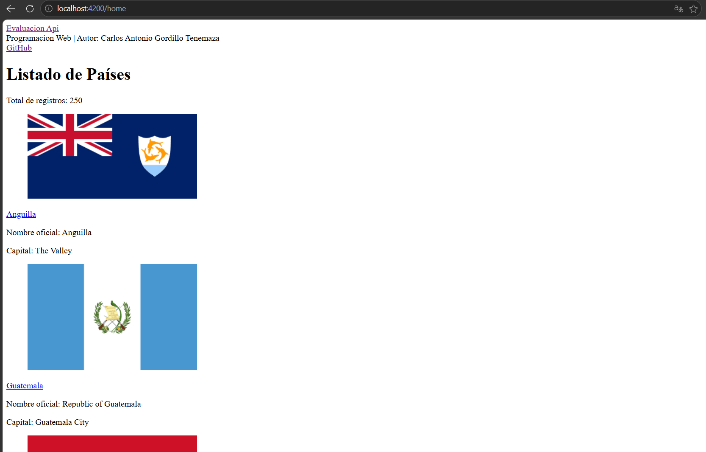
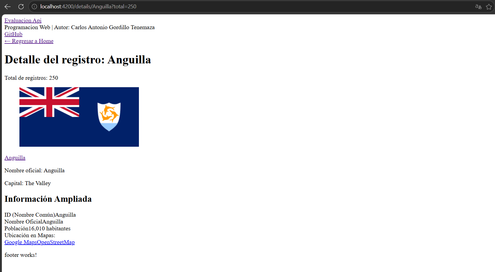

# Práctica 05: Programación Asíncrona

## 📌 Información General

- **Título:** Práctica 05: Programación Asíncrona
- **Asignatura:** Programación y Plataformas Web
- **Carrera:** Ingeniería en Computación
- **Estudiante:** Carlos Antonio Gordillo Tenemaza
- **Semestre:** 5to Semestre

---

## 🧑‍💻 Capturas de Pantalla

### Vista Principal (Home)

### Vista de Detalle (ID)
